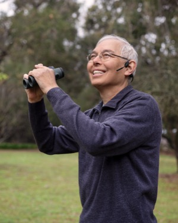

# BirdTalk: Hands-Free eBirding for the Modern Birder

*By John Callender*

"You're always staring at your phone," my wife would say when we birded together. I'm a big fan of eBird, and have more than 2,500 consecutive days in my checklist streak. It feels good to contribute complete, accurate counts of the birds I see and be part of the eBird citizen science project. But she was right. All that time entering data in eBird checklists was taking me away from actual birding.

That all changed when I started using BirdTalk.

## What is BirdTalk?

BirdTalk is an innovative iPhone app developed by Santa Barbara birder and programmer Steve Colwell that allows you to create eBird checklists hands-free using voice commands. With BirdTalk, you keep your phone in your pocket and your eyes on the birds, updating your checklist simply by speaking quietly into a bluetooth headset.

*Steve Colwell using BirdTalk in the field. Photo by Sue Cook*

### The BirdTalk Experience

The beauty of BirdTalk lies in its simplicity and how it transforms your birding experience:

Instead of the constant phone-checking ritual, I simply speak naturally. When I spot a bird, I just say what I see: "Three mockingbirds" or "Red-tailed Hawk." BirdTalk confirms each entry by speaking back to me, so I know it understood correctly.

Need to make a correction? I just say "No, towhee" or "No, three" to fix the last entry. Want to add notes? I say "Memo singing from oak tree" and it's done—all while keeping my eyes on the birds and my hands free for binoculars or camera.

## How to Use BirdTalk

Getting started with BirdTalk is straightforward:

### Setup Requirements

- An iPhone with iOS 15 or above
- An eBird account
- A Bluetooth headset (preferably the OpenComm2 Bone Conduction headset, which leaves your ears unobstructed for birding by ear)
- The TestFlight app (for beta testing)

*BirdTalk screen showing bird observations*

When I'm finished birding, uploading to eBird is straightforward. The app guides me through the process with clear instructions, and my complete checklist—with all species, counts, and notes—is transferred to my eBird account with just a few taps.

The difference is profound: instead of constantly switching attention between birds and phone, I remain fully present in my birding experience while still creating high-quality, complete eBird checklists.

## BirdTalk in Action

BirdTalk truly shines in challenging birding scenarios:

**Mixed Flocks**: When I encountered a large group of gulls at the beach, censusing them went from a mental juggling act to a smooth operation. "Four Western Gulls... six California Gulls... Western Gull... two more..." BirdTalk kept perfect running totals while I kept my binoculars up and my eyes on the birds.

**Rapid Observations**: When arriving at a busy location with multiple species visible and audible, I could now record them all without missing a beat. A Song Sparrow singing while a Black Phoebe flies by? No problem—enter both without looking away.

**Rare Bird Documentation**: The "memo" command is perfect for documenting rarities:

> Me: "One Solitary Sandpiper"
>
> BirdTalk: "Solitary Sandpiper, rare here and now"
>
> Me: "Memo, feeding in the lagoon near coordinates. Photos to come."

The app automatically replaced "coordinates" with my exact GPS location—invaluable for rare bird documentation.

## Getting Access to BirdTalk

BirdTalk is currently available as a beta test. To request access, email Steve at stevebt@membot.com. Include confirmation that you're willing to provide regular feedback to help improve the app.

For those still hesitant about trying BirdTalk, I understand—I was there too. But if you're serious about using eBird to document your birding, this tool will revolutionize your field experience. It's not just about convenience; it's about rediscovering the joy of birding, unencumbered by the mechanics of record-keeping.

*John Callender is a birder based in Santa Barbara County, California. He has maintained a daily eBird checklist streak since 2018 and has been using BirdTalk since its beta release.*
