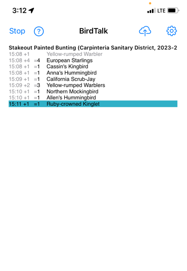

# BirdTalk Command Reference

This guide provides a comprehensive list of all BirdTalk commands, organized by category. Commands are listed in order of most commonly used within each category.

## Essential Commands

### Starting and Stopping

- When a checklist is started, successive bird entries are stored in order.
- Multiple entries of the same species are combined when the checklist is uploaded to eBird.
- When a checklist is stopped, new bird entries are no longer appended to the checklist.  Use the `insert` commands to include forgotten birds into appropriate places in an old checklist.

Commands:

- Say `Start checklist` - Begins a new checklist at current location
- Say `Start archival checklist` - Begins a new checklist at current location, dated 31 days ago, so that it won't show up in eBird notifcations.  Used for entering historical data.
- Say `Stop checklist` - Ends current checklist
- Say `Resume` - Resumes a stopped checklist, so new bird entries are again appended to the checklist.  Leaves a gap of no birds for the period the checklist was stopped.
- Say `Upload later` - Saves current checklist for later upload to eBird.  Must tap the top line or `select` the desired checklist before using.
- Say `Shut down` - Turns off BirdTalk listening.  Same as tapping the Stop button at upper left.  App remains running but doesn't hear voice commands until you tap the Start button at top left.

### Basic Bird Entry

- Say `three mockingbirds` - Records multiple birds of a species
- Say `one robin` - Records a single bird
- Say `mockingbird` - Records one bird (number defaults to 1)

Shorthand examples:

- Say `cal quail` → California Quail
- Say `slope` → Pacific-slope Flycatcher
- Say `yellow-crown` → Yellow-crowned Night-heron
- See [FAQ](../faq.md) for more details.

## Location Management

### Hotspot Selection

- Say `Next` - Switches to next nearby hotspot in menu shown right after `Start checklist`
- Say `Insert checklist` - Creates new checklist header at current position, using the time and location of the following bird entry

## Species and Count Management

### Reviewing Counts

- Say `How many species` - BirdTalk says back total species count for checklist
- Say `How many robins` - BirdTalk says back total count for that species
- Say `How many species today` - BirdTalk says back species count across all today's checklists
- Say `Choose [species]` - Select most recent entry of specified species

### Adjusting Counts

- Say `No, three` - Changes count of last entry (e.g., from 2 to 3)
- Say `One more` - Adds one to current count
- Say `One fewer` - Subtracts one from current count
- Say `No, towhee` - Changes species of last entry
- Say `Make that five total` - Adjusts to reach specific total

### Corrections

- Say `Scratch that` - Removes last entry or memo
- Say `Restore` - Restores last removed entry
- Say `Mark that` - Marks entry for review (turns red)
- Say `Unmark that` - Removes review mark
- Say `Unmark entire checklist` - Removes all review marks

## Comments and Memos

### Adding Comments

- Say `Memo singing from oak tree` - Adds comment to selected entry
- Say `Memo from scratch carrying nesting material` - Replaces existing memo
- Say `Memo nest 10 meters north of coordinates` - Includes coordinates from when bird was first entered
- Say `Memo nest at current coordinates` - Includes coordinates of your current position

### Reading Comments

- Say `Read back` - BirdTalk says back current entry's memo
- Say `Read entire` - BirdTalk says back all memos for current species

### Editing Comments

- Say `Edit memo` - Opens memo editor
- Say `Scratch that` - Removes last added memo text

## Checklist Management

### Navigation

- Say `Choose newest` - Selects most recent entry
- Say `Show coordinates` - Displays GPS coordinates of each point, along with altitude in meters
- Say `Sort by family` - Groups entries by species
- Say `Sort by time` - Shows entries chronologically

<figure markdown>
  { .screenshot }
  <figcaption>Observations sorted by time (default)</figcaption>
</figure>

<figure markdown>
  { .screenshot }
  <figcaption>Observations sorted by family</figcaption>
</figure>

### Upload Management

- Say `Upload later` - Marks current checklist for later upload
- Say `Unfreeze` - Marks an uploaded checklist as not uploaded (allows re-uploading if needed)
- Say `Delete entire checklist` - deletes the checklist whose header line is selected.
- Say `Delete all checklists` - remove <i>every single checklist</i> from BirdTalk, whether uploaded or not.  This is a dangerously powerful command so be very sure that's what you intend before using it.  In fact it's best not to even say this phrase near other people who are using BirdTalk, on the chance that their mic picks up your words.  As a safety measure this feature requires that you first select the top line of the first checklist in your BirdTalk display.

There's nothing wrong with keeping your most recently uploaded checklists in BirdTalk for a few days, until you're completely sure the checklist made it into eBird.  However, you will want to remove old checklists eventually, as BirdTalk slows down if it is holding on to more than 20 or so checklists.

### Information

- Say `How far` - BirdTalk says back distance traveled
- Say `How long` - BirdTalk says back elapsed time
- Say `Time` - BirdTalk says back current time

## Sharing

- Say `Share with three` - marks the checklist as having 3 additional authors in addition to you.  
- The total (4 people in this example) is used for the Party Size field in the uploaded checklist.
- Edit the checklist online, after upload, and use eBird's Share button to specify with whom you are sharing.

### Device Management

- Say `Mute` or `Ignore` - Stops listening for commands
- Say `Resume` or `Listen` or `Unmute` - Resumes listening

## Information

### System Commands

- Say `Time` - BirdTalk speaks current time (also confirms it's listening)
- Say `Feedback [text]` - Stores feedback for later transmission (note: feedback is saved but not sent immediately)
- Say `Send feedback` - Packs all stored feedback into a file that it asks you to email to us

**Next**: For more detailed advice on voice recognition, shorthand names, and troubleshooting, see the [FAQ](../faq.md).
