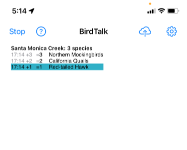

# Getting Started with BirdTalk

This guide will help you start using BirdTalk effectively. It begins with a quick reference of essential features and interface elements, then provides a detailed tutorial with real-world examples.

## Quick Reference

<figure markdown>
  { .screenshot }
  <figcaption>BirdTalk starting screen</figcaption>
</figure>

### The Basics

When you first open BirdTalk, you'll see the main screen with options to start a new checklist or access previous ones. The interface is clean and simple, designed for hands-free operation. Use pinch-to-zoom gestures to adjust text size for better visibility.

Before starting your birding session:

- Test voice recognition by saying "Time"
- BirdTalk should respond with the current time
- If using a Bluetooth headset:
    - Turn it on before starting BirdTalk
    - BirdTalk will automatically use the headset
    - For audio issues, see [Tips and Tricks](tips-and-tricks.md#audio-equipment-tips)

### Essential Commands

<figure markdown>
  { .screenshot }
  <figcaption>Location selection screen showing nearby hotspots</figcaption>
</figure>

**Starting a Checklist**

Say "Start checklist" and BirdTalk will find your location and suggest the nearest eBird hotspot.
If the suggested hotspot isn't correct:

- Say "Next" to see other nearby options
- Or tap a different hotspot on the screen

**Recording Birds**

<figure markdown>
  { .screenshot }
  <figcaption>Screen for adding bird observations</figcaption>
</figure>

Use the basic format: Say "[Number] [Species Name]". For example:

- Say "Three mockingbirds"
- Say "One robin"
- Say "Two cal quail" (shorthand for California Quail)

**Viewing Your List**

BirdTalk offers multiple ways to organize your observations:

- Say "sort by time" (default)
- Say "sort by family"

<figure markdown>
  { .screenshot }
  <figcaption>Observations sorted by time (default)</figcaption>
</figure>

<figure markdown>
  { .screenshot }
  <figcaption>Observations sorted by family</figcaption>
</figure>

**Managing Observation Counts**

Here are the essential commands for managing your observations:

- To check a count: Say "How many robins"
- To change the last entry: Say "No three"
- To add one: Say "One more"
- To subtract one: Say "One fewer"
- To change species: Say "No towhee"

**Getting Help**

<figure markdown>
  { .screenshot }
  <figcaption>Help screen showing available commands</figcaption>
</figure>

The help screen is always available - just say "Help"

Say "Back" to return from the Help screen.

## Detailed Tutorial

Now let's walk through a complete birding session, showing how BirdTalk works in real-world scenarios.

### Starting Your Session

- Turn on your Bluetooth headset
- Open BirdTalk
- Say "Time" to verify voice recognition
- Say "Start checklist"
- BirdTalk suggests "Stow Lake, San Francisco, US-CA"
- Start birding if correct, or say "Next" to step through available locations

### First Observations

- You hear a Song Sparrow:
    * Say "Song Sparrow"
    * BirdTalk adds one Song Sparrow

- You see three Mallards:
    * Say "Three Mallards"
    * BirdTalk adds three Mallards

- Another Song Sparrow singing:
    * Say "Choose Song Sparrow"
    * Say "One more"
    * Say "Memo singing" (adds breeding behavior note)

### Advanced Features

**Correcting Mistakes**

- Species correction:
    * Say "Black Phoebe"
    * Realize it's actually a Say's Phoebe
    * Say "No Say's Phoebe"
    * BirdTalk changes the species

- Count correction:
    * Say "Twelve Western Gulls"
    * Recount shows fourteen
    * Say "No fourteen"
    * BirdTalk updates the count
    * You could also say "two more"

**Using Shorthand Names**

- For Yellow-rumped Warbler:
    * Say "Yellow Rump" or just "Rump"

- For Pacific-slope Flycatcher:
    * Say "Slope"

**Adding Comments**

- For behavior notes:
    * Say "Choose Yellow Rump"
    * Say "Memo foraging with chickadees"

- For location notes:
    * Say "Memo near stone bridge coordinates"
    * BirdTalk automatically replaces the term "coordinates" with the GPS coordinates where you initially entered that species observation
    * You can also say "Memo near current coordinates." The phrase "current coordinates" will be replaced with the coordinates where you were when you issued the command.

### Managing Multiple Species

**Mixed Flock Example**

- Record multiple species quickly:
    * Say "Three Chickadees"
    * Say "Two Ruby Crowned Kinglets"
    * Say "Yellow Rump"

- Add behavior notes:
    * Say "Choose Chickadee"
    * Say "Memo foraging with kinglets and warbler"
    * Say "Choose Kinglet"
    * Say "Memo actively feeding in willows"

**Quick Counts and Reviews**

- Check specific species:
    * Say "How many Song Sparrows"

- Check total species:
    * Say "How many species"

### Uploading to eBird

For detailed instructions on uploading your checklists to eBird, see [Uploading Checklists](uploading-checklists.md). You can upload a single checklist immediately, or mark several checklists to upload together later.

### Tips for Success

- Keep commands simple and direct
- Use shorthand names when they're unique in your area
- Add memos while observations are fresh
- Review your checklist before uploading
- Use "upload later" if you want to double-check details

### Troubleshooting

If BirdTalk doesn't recognize a command:

- Speak more clearly and slightly louder
- Try repeating the exact same phrase
- In noisy conditions, you may need to speak louder

If text is hard to read:
- Use pinch-to-zoom gestures to adjust text size
- Zoom in for better visibility in bright sunlight
- Zoom out to see more content at once

If you make a mistake:

- Say "Scratch that" to remove the last entry
- Say "Restore" if you remove something by mistake

For more advanced features and commands, see the [Command Reference](commands/reference.md).

Continue to [Uploading Checklists](uploading-checklists.md).
