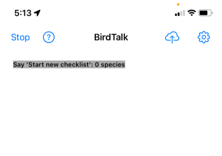

# Getting Started with BirdTalk

This guide will help you start using BirdTalk effectively. It begins with a quick reference of the most useful features and concepts, then tells you where to go to learn more.

## Starting Up

<figure markdown>
  { .screenshot }
  <figcaption>BirdTalk starting screen</figcaption>
</figure>

### The First Screen

When you first open BirdTalk, you'll see the main screen with a list of checklists, if you have any.

- Use pinch-and-zoom to adjust text size for better visibility.

### Audio Check

Before starting your birding session, test that BirdTalk can hear you.

- If "Start" is at the top left, tap that to turn on the recognizer.
- BirdTalk uses the phone's internal mic and speaker by default, or the optional Bluetooth headset (see [Setup](installation/requirements-and-setup.md) for headset details).
- Say `Time` to verify BirdTalk hears and responds with the time.
- For more audio troubleshooting, see the [FAQ](faq.md/#what-if-birdtalk-is-not-responding-to-my-speech)

## BirdTalk is Listening

- When BirdTalk is started, it is listening to everything you say for commands it understands, and ignoring everything else.
- You can talk freely to others and BirdTalk ignores it.
- Pause for a second before and after speaking a BirdTalk command so the command doesn't blend into what you're saying to others.
- Whenever BirdTalk understands your command, it will speak back to let you know exactly what it is doing.  For instance when you say `Robin` it will say back "American Robin" so you konw exactly which species it is adding to your checklist.
- To turn off BirdTalk's listening, tap the "Stop" button at upper left, or say `Shut down`.

## Summary of the Common Commands

Here is a quick list of the most common commands, that you'll use in most checklists:

- Start by saying `Start checklist`
- Add a bird sighting, for example say `Scrub Jay`
- Correct a mistaken entry by saying `No, Bluebird`
- Add bird with a count by saying `2 Robins`
- Remove a mistaken entry by saying `Scratch`
- Stop by saying `Stop checklist`

These are covered in more detail below.

## Checklist Concepts

- Once a checklist is started, successive bird entries are added as they are spoken.
- Successive entries of the same species will be totaled when the checklist is uploaded to eBird.
- You can tap the screen (or use the `choose` command) to select particular entries so you can then `scratch` or otherwise modify them.
- When the checklist is stopped, new bird entries can no longer be added.
- It is possible to modify entries in a stopped checklist.  We'll cover this later in [Command Reference](commands/reference.md).

&nbsp;

## Details of the Common Commands

<figure markdown>
  { .screenshot }
  <figcaption>Location selection screen showing nearby hotspots</figcaption>
</figure>

### Starting a Checklist

Say `Start checklist` and BirdTalk will find your location and suggest the nearest eBird hotspot.

- BirdTalk reads back the chosen hotspot
- If you prefer a different hotspot, tap the desired hotspot on the screen, or use the `Next` comamnd.
- Then say `Share with one` if you are birding with another person, so the eBird checklist will have the right count.

<figure markdown>
  { .screenshot }
  <figcaption>Screen for adding bird observations</figcaption>
</figure>

### Recording Birds

Use the basic format: Say `[Number] [Species Name]`. For example:

- Say `Three mockingbirds`
- Say `One robin`
- Say `Scratch that` to remove the last entry
- Say `Two cal quail` (shorthand for California Quail)
- Say `Red-tailed Hawk`.  If you leave out the number, it just adds one.  

### Other Essential Commands

- To change the last entry: Say `No, three`
- To change species: Say `No, towhee`
- To stop the checklist when all done: Say `Stop checklist`
- See [Uploading Checklists](uploading-checklists.md) to send the checklist to eBird.

That's everything you need to use BirdTalk successfully!

## Learning Other Commands

<figure markdown>
  { .screenshot }
  <figcaption>Help screen showing available commands</figcaption>
</figure>

Tap the ? button (at the upper left of the main screen) to see a summary of BirdTalk's verbal commands.

The most useful other commands are:

- To check a count: Say `How many robins`
- To add one: Say `One more`
- To subtract one: Say `One fewer`
- To add a comment to a bird entry: Say `Memo flycatching at the lake shore`
- To check how many species in the checklist so far, say `How many species`

### Using Shorthand Names

- For Yellow-rumped Warbler:
    * Say `Yellow Rump` or just `Rump`

- For Pacific-slope Flycatcher:
    * Say `Slope`

**Next**: See [Uploading Checklists](uploading-checklists.md).

**Or**: See [Command Reference](commands/reference.md) for a comprehensive list of the verbal commands.
