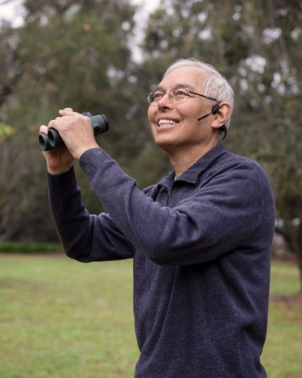

{ .screenshot }

# BirdTalk

BirdTalk is an iPhone app designed to be controlled by spoken instructions, allowing you to record bird observations in the field hands-free, while keeping your phone in your pocket. Using simple voice commands, you can create eBird checklists without taking your eyes off the birds or your hands off the binoculars.

## Key Features

- Voice control for hands-free operation
- Integration with eBird
- Bluetooth device compatibility

## Documentation

- **[Why](testimonial.md)**: Why use BirdTalk -- One birder's BirdTalk journey
- **[Install](installation/requirements-and-setup.md)**: Everything you need to set up BirdTalk on your iPhone
- **[Start](getting-started.md)**: Use the most commands for BirdTalk
- **[Uploading](uploading-checklists.md)**: Step-by-step guide to uploading your checklists to eBird
- **[Reference](commands/reference.md)**: Complete reference for all BirdTalk voice commands
- **[Tips](tips-and-tricks.md)**: Helpful advice for getting the most out of BirdTalk
- **[FAQ](faq.md)**: Answers to frequently asked questions about BirdTalk

## About BirdTalk

BirdTalk is currently in beta testing through TestFlight. See the requirements page if you'd like to join the beta program.

BirdTalk is developed by Steve Colwell with major assistance from iOS expert Lee Hasiuk.  Many thanks to the early Santa Barbara testers Mark Holmgren, Sue Cook, David Blue, and Conor McMahon, and to John Callender for documentation support.

For support or feedback, contact Steve at [stevebt@membot.com](mailto:stevebt@membot.com).

<i>Steve Colwell is a birder and retired computer programmer in Santa Barbara, California.</i>

**Next**: [Testimonial](testimonial.md)
