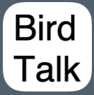

# BirdTalk Documentation

<figure markdown>
  { .screenshot }
  <figcaption>BirdTalk logo (placeholder - to be replaced with field photo)</figcaption>
</figure>

BirdTalk is an iOS app designed to be controlled entirely by spoken instructions, allowing you to record bird observations in the field while keeping your phone in your pocket. Using simple voice commands, you can create and upload eBird checklists without taking your eyes off the birds or handling your device.

## Key Features

- Voice control for hands-free operation
- Integration with eBird
- Bluetooth device compatibility

## Documentation

- **[Requirements and Installation](installation/requirements-and-setup.md)**: Everything you need to get started with BirdTalk
- **[Getting Started](getting-started.md)**: Essential commands and detailed tutorial for using BirdTalk
- **[Uploading Checklists](uploading-checklists.md)**: Step-by-step guide to uploading your checklists to eBird
- **[Command Reference](commands/reference.md)**: Complete reference for all BirdTalk voice commands
- **[Tips and Tricks](tips-and-tricks.md)**: Helpful advice for getting the most out of BirdTalk
- **[FAQ](faq.md)**: Answers to frequently asked questions about BirdTalk

## About BirdTalk

BirdTalk is currently in beta testing through TestFlight. The app is designed to enhance the birding experience by allowing birders to maintain their focus on birds while easily recording their observations.

## Acknowledgments

BirdTalk is developed by Steve Colwell with major assistance from iOS expert Lee Hasiuk, extensive feedback from our Santa Barbara beta testers, especially Mark Holmgren and Sue Cook, and documentation support from John Callender.

For support or feedback, contact Steve at [stevebt@membot.com](mailto:stevebt@membot.com).
