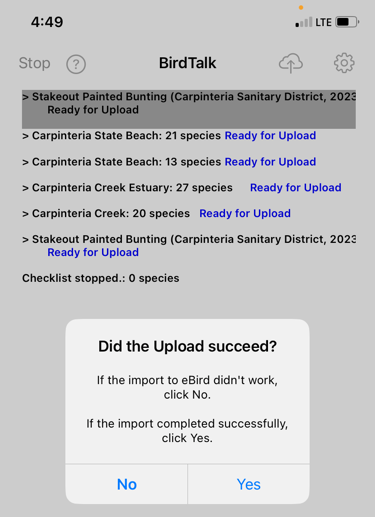
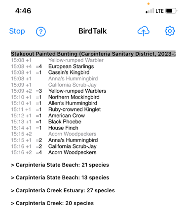
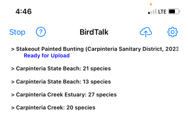

# Your First BirdTalk Session

This guide walks you through your first birding session with BirdTalk, focusing on the most essential commands you'll need.

## Essential Commands Tutorial

### 1. Starting BirdTalk

When you first open BirdTalk, you'll see the main screen with options to start a new checklist or access previous ones. The interface is clean and simple, designed for hands-free operation.

<figure markdown>
  { .screenshot }
  <figcaption>BirdTalk starting screen</figcaption>
</figure>

Before starting your birding session:

- Test voice recognition by saying "Time"
- BirdTalk should respond with the current time
- If using a Bluetooth headset:
    - Turn it on before starting BirdTalk
    - BirdTalk will automatically use the headset
    - For audio issues, see [Tips and Tricks](../tips-and-tricks.md#audio-equipment-tips)

### 2. Starting a Checklist

When you're ready to begin birding, say "Start checklist". BirdTalk will find your location and suggest the nearest eBird hotspot. You can accept the suggested location or choose a different one.

<figure markdown>
  { .screenshot }
  <figcaption>Location selection screen showing nearby hotspots</figcaption>
</figure>

If the suggested hotspot isn't correct:

- Say "Next" to see other nearby options
- Or tap a different hotspot on the screen

### 3. Adding Birds

Recording birds is straightforward using the basic format: "[Number] [Species Name]". The interface clearly shows your entries and makes it easy to verify what you've recorded.

<figure markdown>
  { .screenshot }
  <figcaption>Screen for adding bird observations</figcaption>
</figure>

Examples of voice commands:

```
"Three mockingbirds"
"One robin"
"Two cal quail"    (shorthand for California Quail)
```

Tips for adding birds:

- If no number is specified, BirdTalk assumes "one"
- You can use shortened species names if they're unique in your area
- If BirdTalk doesn't recognize a name the first time, repeat the exact same phrase - it will try harder to understand

### 4. Reviewing and Adjusting Counts

BirdTalk offers multiple ways to view and organize your observations. You can sort them by family or species name to help spot patterns or verify counts.

<figure markdown>
  { .screenshot }
  <figcaption>Observations sorted by family</figcaption>
</figure>

<figure markdown>
  { .screenshot }
  <figcaption>Observations sorted by species name</figcaption>
</figure>

Common commands for managing counts:

- To check a count: "How many robins" (or any species)
- To change the last entry: "No, three" (changes to 3)
- To add one: "One more"
- To subtract one: "One fewer"
- To change species: "No, towhee"

### 5. Ending and Uploading

When you're finished observing:

1. Say "Stop checklist" to end the current checklist
2. Review your entries on screen
3. Say "How many species" to get your total count

For uploading to eBird, first select your checklist by tapping the header (gray bar at top) or saying "Select checklist". For detailed instructions with screenshots of the entire upload process, see the [Uploading Checklists](../uploading-checklists.md) guide.

You have two upload options:

Option 1 - Upload now:

- Tap the upload button (up arrow pointing to cloud)
- Follow the prompts to complete the upload

<figure markdown>
  { .screenshot }
  <figcaption>eBird upload form</figcaption>
</figure>

<figure markdown>
  { .screenshot }
  <figcaption>Upload confirmation screen</figcaption>
</figure>

Option 2 - Upload later:

- Say "Upload later" to save the checklist
- When ready, select the checklist and tap upload

<figure markdown>
  { .screenshot }
  <figcaption>Selecting a checklist to mark for later upload</figcaption>
</figure>

<figure markdown>
  { .screenshot }
  <figcaption>Checklist marked for uploading later</figcaption>
</figure>

## Common Issues and Solutions

If BirdTalk doesn't recognize a command:

- Speak more clearly and slightly louder
- Try repeating the exact same phrase
- In noisy conditions, you may need to speak louder

If you make a mistake:

- Say "Scratch that" to remove the last entry
- Say "Restore" if you remove something by mistake

For more troubleshooting tips and solutions, see the [Tips and Tricks](../tips-and-tricks.md) guide.

## Next Steps

When you're ready to learn more, check out the complete [Command Reference](../commands/reference.md) for all available commands and features.

## Need Help?

The help screen is always available - just say "Help" to see available commands, or "Back" to return to the main screen.

<figure markdown>
  { .screenshot }
  <figcaption>Help screen showing available commands</figcaption>
</figure>
