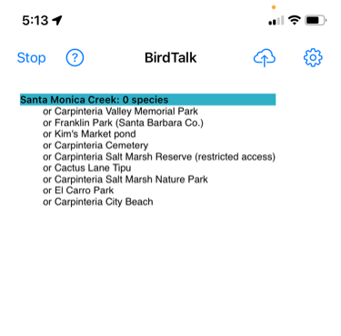

# Your First BirdTalk Session

This guide walks you through your first birding session with BirdTalk, focusing on the most essential commands you'll need.

## Essential Commands Tutorial

### 1. Starting BirdTalk

1. Open the BirdTalk app


2. Test voice recognition:
    - Say: "Time"
    - BirdTalk should respond with the current time
3. If using a Bluetooth headset:
    - Turn on your headset before starting BirdTalk
    - BirdTalk will automatically use the headset for audio
    - If you have any audio issues, see [Tips and Tricks](../tips-and-tricks.md#audio-equipment-tips)

### 2. Starting a Checklist

1. Say: "Start checklist"
    - BirdTalk will find your location
    - It will suggest the nearest eBird hotspot



2. If the suggested hotspot isn't correct:
    - Say: "Next" to see other nearby options
    - Or tap a different hotspot on the screen

### 3. Adding Birds

Basic format: "[Number] [Species Name]"

Examples:
```
"Three mockingbirds"
"One robin"
"Two cal quail"    (shorthand for California Quail)
```


Tips:

- If no number is specified, BirdTalk assumes "one"
- You can use shortened species names if they're unique in your area
- If BirdTalk doesn't recognize a name the first time, repeat the exact same phrase - it will try harder to understand

### 4. Reviewing and Adjusting Counts

To check current count:

- Say: "How many robins" (or any species)
- BirdTalk will tell you the total count

You can sort your observations by family or species name:


To adjust counts:

- To change the last entry: "No, three" (changes to 3)
- To add one: "One more"
- To subtract one: "One fewer"
- To change species: "No, towhee"

### 5. Ending and Uploading

1. When finished observing:
    - Say: "Stop checklist"
    - This ends the current checklist

2. Review your checklist:
    - Look over the entries on screen
    - Say: "How many species" to get total species count

3. To upload to eBird:
    - First, select the checklist:
        - Tap the checklist header (the gray bar at the top of your checklist) or say: "Select checklist"

    For detailed instructions with screenshots of the entire upload process, see the [Uploading Checklists](../uploading-checklists.md) guide.

    - Then choose one of these options:
        - Option 1 - Upload now:
            - Tap the upload button (up arrow pointing to cloud)
            - Follow the prompts to complete the upload

            
            

        - Option 2 - Upload later:
            - Say: "Upload later"
            - Your checklist will be saved
            - When you're ready to upload, select the checklist and tap the upload button

            
            

## Common Issues and Solutions

- If BirdTalk doesn't recognize a command:
    - Speak more clearly and slightly louder
    - Try repeating the exact same phrase
    - In noisy conditions, you may need to speak louder

- If you make a mistake:
    - Say "Scratch that" to remove the last entry
    - Say "Restore" if you remove something by mistake

For more troubleshooting tips and solutions, see the [Tips and Tricks](../tips-and-tricks.md) guide.

## Next Steps

When you're ready to learn more, check out the complete [Command Reference](../commands/reference.md) for all available commands and features.

## Need Help?

- Say "Help" at any time to see available commands
- Say "Back" to return to the main screen


