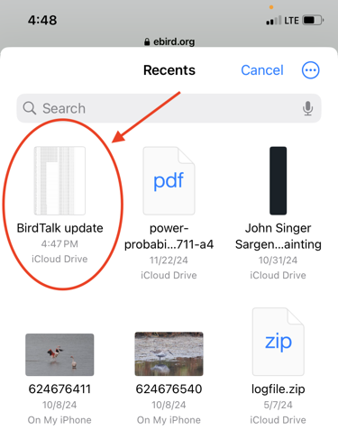
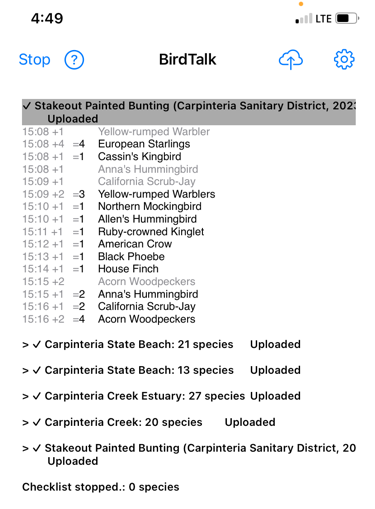

# Uploading Checklists to eBird

This guide walks you through the complete process of uploading your BirdTalk checklists to eBird, including both immediate uploads and managing saved checklists for later upload.

## Upload Options

### Option 1: Upload Immediately

When you finish a checklist, you can upload it right away:

1. Select your checklist by tapping the header or saying "Select checklist"
2. Tap the upload button (up arrow pointing to cloud)
3. Follow the upload process:

*The upload form where you'll enter your eBird credentials*

*A closer look at the form fields*

### Option 2: Save for Later Upload

You can save checklists to upload them later:

1. Select your checklist
2. Say "Upload later" or use the menu options

*Selecting a checklist to mark for later upload*

*The checklist is now marked for later upload*

You can mark multiple checklists for later upload:

*Multiple checklists marked for upload*

## Upload Process

1. When you're ready to upload, tap the upload button
2. The upload help page will guide you through the process:

*Upload help page with instructions*

3. Choose the checklist file when prompted:

*The file selection popup*

*Selecting your checklist file*

4. Complete the upload form:

*Form ready for submission*

5. Upload progress:

*Upload in progress indicator*

6. Confirmation:

*Success confirmation*

*Detailed confirmation screen*

*Upload process completed*

7. After successful upload, your checklists will be cleared:

*Checklists removed after successful upload*

## Tips for Successful Uploads

- Ensure you have a stable internet connection
- Have your eBird credentials ready
- Review your checklists before uploading
- You can upload multiple checklists at once
- After successful upload, BirdTalk automatically removes the uploaded checklists

## Troubleshooting

If you encounter issues during upload:
- Check your internet connection
- Verify your eBird credentials
- Make sure all entries are unmarked (no red text)
- Try uploading one checklist at a time if uploading multiple lists fails
