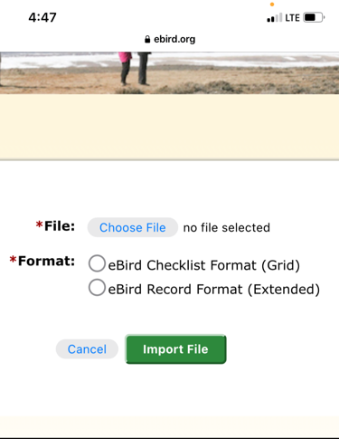
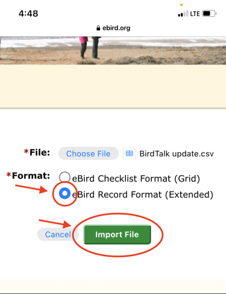

# Uploading Checklists to eBird

This guide walks you through the complete process of uploading your BirdTalk checklists to eBird, including both immediate uploads and managing saved checklists for later upload.

## Upload Options

### Option 1: Upload Immediately

When you finish a checklist, you can upload it right away. The process is straightforward:

1. Select your checklist by tapping the header or saying "Select checklist"
2. Tap the upload button (up arrow pointing to cloud)
3. Follow the prompts to complete the upload

<figure markdown>
  { .screenshot }
  <figcaption>The upload form where you'll enter your eBird credentials</figcaption>
</figure>

The upload form provides all the necessary fields for submitting your checklist to eBird. Take a moment to review the details before submitting.

<figure markdown>
  { .screenshot }
  <figcaption>A closer look at the form fields</figcaption>
</figure>

### Option 2: Save for Later Upload

Sometimes you might want to save checklists to upload them later. This is useful when you want to:

- Review your observations more carefully
- Wait for a better internet connection
- Upload multiple checklists at once
- Continue birding without interruption

<figure markdown>
  { .screenshot }
  <figcaption>Selecting a checklist to mark for later upload</figcaption>
</figure>

To save a checklist for later:

1. Select your checklist
2. Say "Upload later" or use the menu options

<figure markdown>
  { .screenshot }
  <figcaption>The checklist is now marked for later upload</figcaption>
</figure>

You can mark multiple checklists for later upload, which is particularly useful when you're doing several short counts in one area.

<figure markdown>
  { .screenshot }
  <figcaption>Multiple checklists marked for upload</figcaption>
</figure>

## Upload Process

When you're ready to upload your saved checklists, BirdTalk provides clear guidance through each step.

<figure markdown>
  { .screenshot }
  <figcaption>Upload help page with instructions</figcaption>
</figure>

The file selection process is straightforward:

<figure markdown>
  { .screenshot }
  <figcaption>The file selection popup</figcaption>
</figure>

<figure markdown>
  { .screenshot }
  <figcaption>Selecting your checklist file</figcaption>
</figure>

Once you've selected your file, you'll see the upload form ready for submission:

<figure markdown>
  { .screenshot }
  <figcaption>Form ready for submission</figcaption>
</figure>

During the upload, BirdTalk shows a progress indicator:

<figure markdown>
  { .screenshot }
  <figcaption>Upload in progress indicator</figcaption>
</figure>

Upon successful upload, you'll see confirmation screens:

<figure markdown>
  { .screenshot }
  <figcaption>Success confirmation</figcaption>
</figure>

<figure markdown>
  { .screenshot }
  <figcaption>Detailed confirmation screen</figcaption>
</figure>

<figure markdown>
  { .screenshot }
  <figcaption>Upload process completed</figcaption>
</figure>

After successful upload, BirdTalk marks the checklists as uploaded and collapses them:

<figure markdown>
  { .screenshot }
  <figcaption>Checklists marked as uploaded and collapsed</figcaption>
</figure>

Note: If you need to re-upload a checklist (for example, if there was an error during upload), you can use the "Unfreeze" command to mark it as not uploaded. See the [Command Reference](commands/reference.md) for details.

## Tips for Successful Uploads

A few key points to ensure smooth uploads:

- Ensure you have a stable internet connection
- Have your eBird credentials ready
- Review your checklists before uploading
- You can upload multiple checklists at once

## Troubleshooting

If you encounter issues during upload:

- Check your internet connection
- Verify your eBird credentials
- Make sure all entries are unmarked (no red text)
- Try uploading one checklist at a time if uploading multiple lists fails
