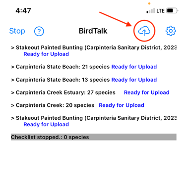
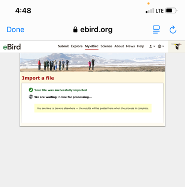

# Uploading Checklists to eBird

This guide walks you through the complete process of uploading your BirdTalk checklists to eBird, including both immediate uploads and managing saved checklists for later upload.

## Upload Options

### Option 1: Upload Immediately

When you finish a checklist, you can upload it right away. The process is straightforward:

1. Select your checklist by tapping the header or saying "Select checklist"
2. Tap the upload button (up arrow pointing to cloud)
3. Follow the prompts to complete the upload (see "Upload Process" below)

<figure markdown>
  { .screenshot }
  <figcaption>Tap the upload button to upload a checklist to eBird</figcaption>
</figure>

### Option 2: Save for Later Upload

Sometimes you might want to save checklists to upload them later. This is useful when you want to:

- Review your observations more carefully before uploading
- Wait for a better internet connection
- Upload multiple checklists at once

To save a checklist for later upload:

1. Select your checklist by saying "Select checklist" or tapping the checklist header
2. Say "Upload later"

<figure markdown>
  { .screenshot }
  <figcaption>The checklist is now marked for later upload</figcaption>
</figure>

You can mark multiple checklists for later upload, which is particularly useful when you're doing several short counts in one area.

<figure markdown>
  { .screenshot }
  <figcaption>Multiple checklists marked for upload</figcaption>
</figure>

## Upload Process

When you're ready to upload your saved checklists, BirdTalk provides clear guidance through each step.

Begin by tapping the upload button (up arrow pointing at a cloud).

<figure markdown>
  { .screenshot }
  <figcaption>Tap the upload button to begin the upload process</figcaption>
</figure>

This will launch your phone's web browser, displaying the Upload Help page. On that page, tap on the link under Step 2 labeled "eBird's File Import web page"

<figure markdown>
  { .screenshot }
  <figcaption>Upload help page showing the link to tap</figcaption>
</figure>

This will take you to eBird's file import page:

<figure markdown>
  { .screenshot }
  <figcaption>The eBird file import page</figcaption>
</figure>

Once there, it's helpful if you use a pinch-to-zoom gesture, spreading two fingers to magnify the page and make the form easier to use:

<figure markdown>
  { .screenshot }
  <figcaption>Zoomed in file import form</figcaption>
</figure>

Tap "Choose File", which will open a popup menu. Choose the bottom choice on the popup, labeled "Choose File".

<figure markdown>
  { .screenshot }
  <figcaption>Selecting "Choose File" from the popup menu</figcaption>
</figure>

This will open a screen where you will see a file labeled "BirdTalk update" in the upper lefthand corner. Tap that file to select it.

<figure markdown>
  { .screenshot }
  <figcaption>Selecting your checklist file</figcaption>
</figure>

Once you've selected your file, you'll return to the upload form. Select "eBird Record Format (Extended)" for the format, then tap the "Import File" button to begin the upload process.

<figure markdown>
  { .screenshot }
  <figcaption>Form ready for submission</figcaption>
</figure>

During the upload process, the eBird site will show you a status page. It will say "You are free to browse elsewhere," but you should ignore that. Just wait for the processing to finish.

<figure markdown>
  { .screenshot }
  <figcaption>Upload in progress indicator</figcaption>
</figure>

Upon successful upload, you'll see a confirmation screen:

<figure markdown>
  { .screenshot }
  <figcaption>Success confirmation</figcaption>
</figure>

Click "Done" in the upper lefthand corner, which will bring you back to BirdTalk. It will ask you whether the upload succeeded. Tap "Yes" to indicate success, "No" if the upload did not complete successfully. (In the case of an unsuccessful upload you can try again later, perhaps when you have better connectivity.)

<figure markdown>
  { .screenshot }
  <figcaption>Detailed confirmation screen</figcaption>
</figure>

After successful upload, BirdTalk marks the checklists as uploaded.

<figure markdown>
  { .screenshot }
  <figcaption>Upload process completed</figcaption>
</figure>

When a checklist has been successfully uploaded, you can select the checklist location header and say, "Delete Checklist" to delete the checklist from BirdTalk. If you want to delete multiple checklists, select the first one and say, "Delete All Checklists".

<figure markdown>
  { .screenshot }
  <figcaption>Checklists deleted</figcaption>
</figure>

Note: If you need to re-upload a checklist that was already marked as successfully uploaded (for example, if there was an error during upload), you can use the "Unfreeze" command to mark it as not uploaded. See the [Command Reference](commands/reference.md) for details.

## Tips for Successful Uploads

A few key points to ensure smooth uploads:

- Ensure you have a stable internet connection
- Review your checklists before uploading
- You can save time by uploading multiple checklists at once

## Troubleshooting

If you encounter issues during upload:

- Check your internet connection
- Make sure all marked observations are unmarked (no red text)
- Try uploading one checklist at a time if uploading multiple lists fails
